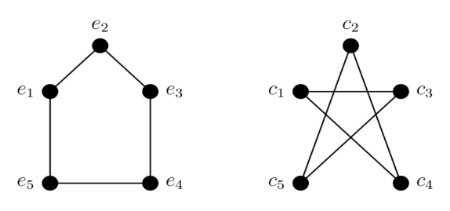
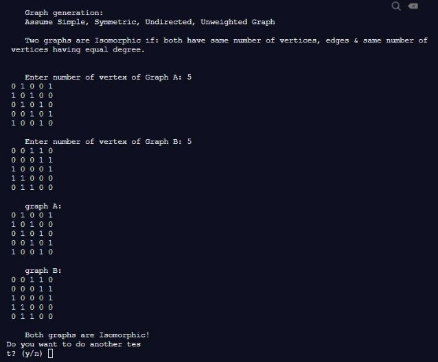
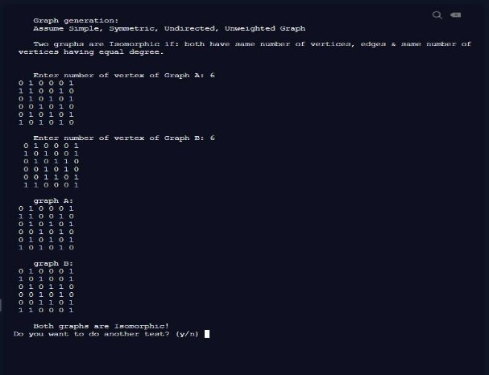
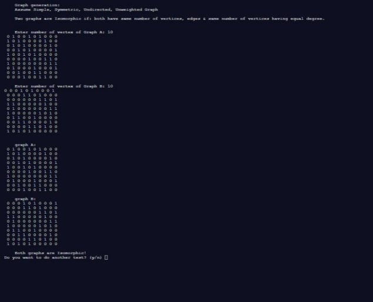
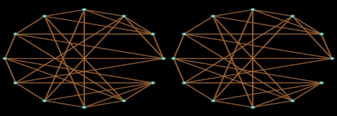
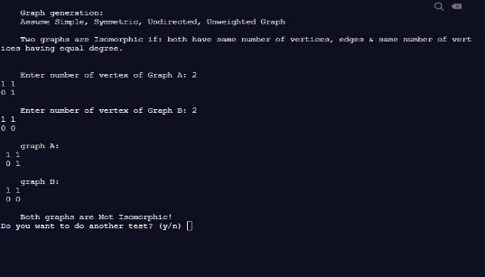

**Graph Isomorphism program Bilal Niazi, 200408168**

**April 15, 2021**

**Abstract**

This project is about getting a program to figure out whether or not a given graph matrix is isomorphic or not using the definition of graph isomorphism. This paper will provide examples of problems and how the program works.

**Introduction**

Graph isomorphism is the unique way of a graph being the same but taking different shapes. There are a few conditions which qualify a graph to be isomorphic, ones used with exception of the program being simpler which will be talked about are from the course Math 327 notes provided by professor Karen Meagher.

“

1. |V1| = |V2|
1. |E1| = |E2|
1. G and H have the same number of connected components.
1. G and H have the same degree sequence.
1. If G contains Km as a subgraph, then H contains Km as a subgraph.
1. G and H contain the same number of triangles

”(Meagher)

Examples of the program working for both isomorphic and non-isomorphic graphs will be shown.

**The Program**

The program makes use of function calls to test both graphs for isomorphism. Program has functions to generate, display, check degree, sorting, and isomorphism check. The main function includes everything else. This program is set to continue running until you enter character N or n (for no) or Y/y for yes to continue when it asks after each completion.

The main function asks for input of the vertex of graph A then it asks for the graph matrice: The following is an example of 2x2 to which you enter your first vertice and what it connects to either in format

A B

C D

A B C D

A B C D etc..

Then you enter the values of graph B the same way as graph A, then it’ll calculate if the two graphs are isomorphic or not.

The code first generates the graph matrix, then it will display the matrix to the user  from which it then uses a series of if/else loops to calculate if the vertex, and degrees are the same. If the degrees are the same it will sort the the two, and run the function “isomorphic” which returns us a value of 1 or 0 where if its 1 they are not isomorphic but if 0 they are isomorphic.if any of the loops fail, it’ll conclude that the graphs are not isomorphic.

**Five vertices**

(Mathematics | Graph Isomorphisms and Connectivity - GeeksforGeeks, 2020)

**The graph matrix of Graph e (A) Graph (B)**

0 1 0 0 1 0 0 1 1 0 1 0 1 0 0 0 0 0 1 1 0 1 0 1 0 1 0 0 0 1 0 0 1 0 1 1 1 0 0 0 1 0 0 1 0 0 1 1 0 0

**Six Vertices (error)**

**(Mathematics | Graph Isomorphisms and Connectivity - GeeksforGeeks, 2020) Graph A Graph B**

0 1 0 0 0 1 0 1 0 0 0 1 1 1 0 0 1 0 1 0 1 0 0 1 0 1 0 1 0 1 0 1 0 1 1 0 0 0 1 0 1 0 0 0 1 0 1 0 0 1 0 1 0 1 0 0 1 1 0 1 1 0 1 0 1 0 1 1 0 0 0 1

The reason for an error here is because the program is designed for simpler graphs, and doesn’t calculate the triangles so thus since the graphs differ in amount of triangles, it won't be isomorphic. I could not get the triangles to work for this one, the code needs some more work which I plan for during the summer.

**Other examples of program Peterson(10)**

**(The Graph Isomorphism Algorithm, 2020)**

**Graph A**

**0 1 0 0 1 0 1 0 0 0 1 0 1 0 0 0 0 1 0 0 0 1 0 1 0 0 0 0 1 0 0 0 1 0 1 0 0 0 0 1 1 0 0 1 0 1 0 0 0 0 0 0 0 0 1 0 0 1 1 0 1 0 0 0 0 0 0 0 1 1 0 1 0 0 0 1 0 0 0 1 0 0 1 0 0 1 1 0 0 0 0 0 0 1 0 0 1 1 0 0**

**Graph B**

**0 0 0 1 0 1 0 0 0 1 0 0 0 1 1 0 1 0 0 0 0 0 0 0 0 0 1 1 0 1 1 1 0 0 0 0 0 1 0 0 0 1 0 0 0 0 0 0 1 1 1 0 0 0 0 0 1 0 1 0 0 1 1 0 0 1 0 0 0 0 0 0 1 1 0 0 0 0 1 0**

**0 0 0 0 1 1 0 1 0 0 1 0 1 0 1 0 0 0 0 0**

**Icosahedron graph(12)**

**(The Graph Isomorphism Algorithm, 2020)**

**Graph A**

**0 1 1 0 0 1 1 1 0 0 0 0 1 0 1 1 1 1 0 0 0 0 0 0 1 1 0 1 0 0 0 1 1 0 0 0 0 1 1 0 1 0 0 0 1 1 0 0 0 1 0 1 0 1 0 0 0 1 1 0 1 1 0 0 1 0 1 0 0 0 1 0 1 0 0 0 0 1 0 1 0 0 1 1 1 0 1 0 0 0 1 0 1 0 0 1 0 0 1 1 0 0 0 1 0 1 0 1 0 0 0 1 1 0 0 0 1 0 1 1 0 0 0 0 1 1 1 0 0 1 0 1 0 0 0 0 0 0 1 1 1 1 1 0**

**Graph B**

**0 0 1 0 0 1 0 0 1 1 0 1 0 0 0 1 1 0 0 1 1 0 0 1 1 0 0 0 0 1 0 1 1 0 1 0 0 1 0 0 1 0 1 1 0 0 1 0 0 1 0 1 0 0 1 0 0 1 0 1 1 0 1 0 0 0 1 0 0 1 1 0 0 0 0 1 1 1 0 0 0 1 1 0 0 1 1 1 0 0 0 0 1 0 1 0 1 1 1 0 0 0 0 1 0 0 0 1 1 0 0 0 1 1 1 0 0 0 0 1**

**0 0 1 1 0 1 1 1 0 0 0 0 1 1 0 0 1 0 0 0 1 1 0 0**

**Non-isomorphic example**

**Conclusion**

This  program only works for simple graphs, as the graphs get advanced, the program will fail to meet the requirements. This program is simply here for helping understand the relation between coding and graphs and how it's implemented to make it work for isomorphic graphs. It’ll require a lot more coding in order to become a final program, which I've been continuously working at, using different examples and such,I have been able to implement things I learned in winter semester 2021, with failure and success. The program is designed to reach over 100 vertices, but  to go so far will need a lot of computing power and time, no less to say writing down the inputs of the two graphs being 100x100. There are other complete programs which can do better for example NAUTY, or ISOMORPHISM, to which both are amazing in terms of programming.

**References**

Dharwadker.org. 2021. *The Graph Isomorphism Algorithm*. [online] Available at: <http://www.dharwadker.org/tevet/isomorphism/> [Accessed 13 April 2021].

GeeksforGeeks. 2021. *Mathematics | Graph Isomorphisms and Connectivity -*

*GeeksforGeeks*. [online] Available at: <https://www.geeksforgeeks.org/mathematics-graph-isomorphisms-connectivity> [Accessed 13 April 2021].

Meagher, K., 2020. *Math 327 Topic 8 Special Graphs And Isomorphism* [December 21,

2020].

Tutorialspoint.com. 2021. *Graph Theory - Isomorphism - Tutorialspoint*. [online] Available

at: <https://www.tutorialspoint.com/graph\_theory/graph\_theory\_isomorphism.htm> [Accessed 10 April 2021].
